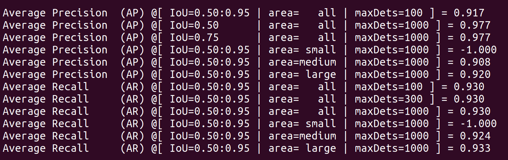
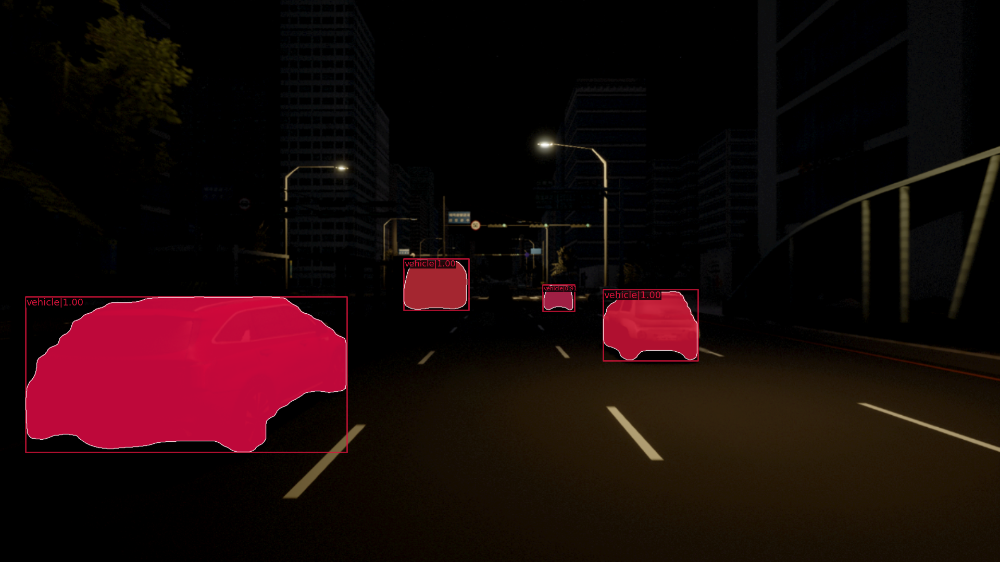

## Introduction

This Repository is for NIA project in Divinetech.

The data published to the NIA is the usage data for this model. It will be posted on the NIA Soon. I'll link it later.

I use MMdetection Package for using MaskRCNN

Here's link
https://github.com/open-mmlab/mmdetection

<div align="center">
  
  
</div>

<br><br>

## Training Guide

- gt2coco_split.py

  - -a 에 outputJson 경로를 입력하면, outputJson 안의 Json을 train : val : test (8:1:1) 로 나누어 각각 coco style json file로 만들어줍니다.

  - -o 에는 나눈 json 을 저장할 폴더 경로를 작성해줍니다. (test.json, train.json, validation.json 생성)

```
python tools/dataset_converters/gt2coco_split.py -a '/home/divinetech/kim_pro/nia_maskrcnn/mask/gtprogram_ver.0.0.9/outputJson/' -o '/home/divinetech/kim_pro/nia_maskrcnn/mask/gtprogram_ver.0.0.9'
```

- maskrcnn_train.py
  - config 설정 및 train을 진행할 수 있는 파이썬 파일 입니다.
  - 설정할 수 있는 옵션은 다음과 같습니다.

|       옵션        | 설명                                                |
| :---------------: | --------------------------------------------------- |
|    --data_root    | json 파일이 있고, Image_RGB 폴더가 있는 폴더의 경로 |
|    --class_num    | 클래스 갯수                                         |
| --samples_per_gpu | GPU 당 Batch size                                   |
| --workers_per_gpu | CPU가 GPU에 전달하는 병렬 프로세스 갯수             |
|   --img_prefix    | Image 파일들이 있는 폴더 경로                       |
|  --learning_rate  | 학습률                                              |
|   --max_epochs    | 최대 epochs 횟수                                    |
|   --checkpoint    | 몇 회 epochs 마다 로그와 학습 모델을 저장할 것인지  |
| --checkpoint_file | pretrained model file                               |

```
python maskrcnn_train.py --data_root='/home/divinetechkim_pro/nia_maskrcnn/mask/gtprogram_ver.0.0.9' --learning_rate 0.025  --max_epochs 36 --checkpoint 6
```

- tensorboard
  - tutorial_exps/tf_logs 안에 loss와 acc 와 같은 스칼라 값이 저장됩니다.
  - 이를 텐서 보드 명령어를 통해 확인할 수 있습니다.
  - localhost:6006

```
tensorboard --logdir ./tutorial_exps/tf_logs/
```


<br><br>

## Test Guide

- show_test_output 폴더에 결과 이미지들이 저장이 됩니다.

```
python maskrcnn_test.py ./tutorial_exps/carla_maskrcnn_conf.py ./tutorial_exps/latest.pth --eval 'bbox' --show_dir ./show_test_output/
```




<br><br>

## Citation

@article{mmdetection,
title = {{MMDetection}: Open MMLab Detection Toolbox and Benchmark},
author = {Chen, Kai and Wang, Jiaqi and Pang, Jiangmiao and Cao, Yuhang and
Xiong, Yu and Li, Xiaoxiao and Sun, Shuyang and Feng, Wansen and
Liu, Ziwei and Xu, Jiarui and Zhang, Zheng and Cheng, Dazhi and
Zhu, Chenchen and Cheng, Tianheng and Zhao, Qijie and Li, Buyu and
Lu, Xin and Zhu, Rui and Wu, Yue and Dai, Jifeng and Wang, Jingdong
and Shi, Jianping and Ouyang, Wanli and Loy, Chen Change and Lin, Dahua},
journal= {arXiv preprint arXiv:1906.07155},
year={2019}
}

```

```
